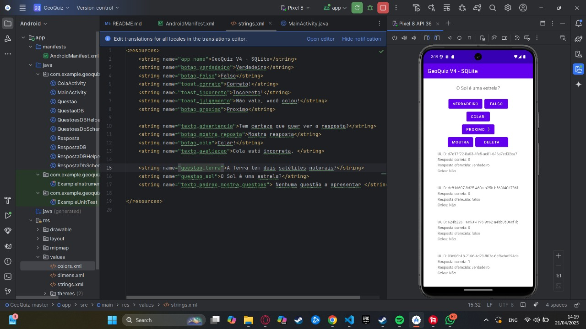
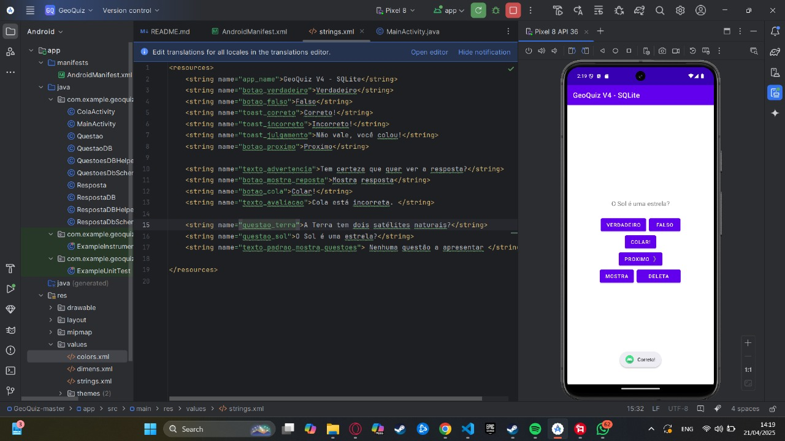

# Aplicações Móveis

## 📦 GeoQuiz Original
Este documento descreve as modificações feitas no projeto **GeoQuiz** original, detalhando as mudanças implementadas na nova versão, bem como as ferramentas e versões utilizadas no ciclo de desenvolvimento.

---
- **Autor:** Udo Fritzke  
- **Link do Repositório:** [https://github.com/udofritzke/GeoQuiz](https://github.com/udofritzke/GeoQuiz)  
- **Descrição:** Aplicativo Android de perguntas e respostas com foco em conhecimentos geográficos. Baseado no exemplo do livro *Android Programming: The Big Nerd Ranch Guide*.

### 🔧 Versão do Android Studio:
- **Não reportada** no repositório original.

### ✅ Funcionalidades da Versão Base:

- Apresentação de perguntas com botões de resposta **"Verdadeiro"** ou **"Falso"**.
- Exibição de **feedback visual** após a resposta (correta/incorreta).
- **Contador de acertos** baseado nas respostas fornecidas.
- Navegação sequencial entre perguntas com botão de **Próxima**.

# 🚀 GeoQuiz Modificado 

> 📌 Repositório em desenvolvimento com melhorias significativas no controle de respostas e experiência do usuário.

---

## 👥 Autores
**Kleberson Crystyan de Lima**  
**Vinicius Fernandes Betti**  
**Vitor Hugo Granato Moreira do Prado**
**Gabriel Henrique Custódio**

---

## 📌 Sobre o Projeto

Este repositório apresenta uma versão estendida do aplicativo **GeoQuiz**, com foco em:

- 📈 **Automatização do registro de respostas**  
- 🧠 **Melhoria da experiência interativa do usuário**  
- 📊 **Controle mais eficiente dos dados persistidos**

---

## ⚙️ Funcionalidades Implementadas

### ✅ Registro Automático de Respostas
- Armazena:
  - UUID da questão
  - Resposta correta (0 ou 1)
  - Resposta do usuário (true/false)
  - Uso de cola (booleano)

### ❌ Remoção do botão `CADASTRA`
- Persistência agora é automática após o clique em **Verdadeiro/Falso**

### 🔍 Redefinição do botão `MOSTRA`
- Exibe todas as respostas registradas  
- Permite visualização em **tempo real**

### 🗑️ Novo botão `DELETA`
- Habilita exclusão dos registros de respostas

---

## 🧠 Melhorias Técnicas

- 🔄 **Otimização do fluxo de armazenamento**
- 🎨 **Simplificação da interface gráfica**
- 📚 **Gestão mais intuitiva do histórico de respostas**

---

## 🛠️ Ambiente de Desenvolvimento

| Plataforma           | Versão / Ferramenta                  |
|----------------------|--------------------------------------|
| Android Studio       | `2024.3.1 Patch 1 (Meerkat)`         |
| Gradle               | `8.6.1`                              |
| SDK mínimo           | `24`                                 |
| API alvo             | `33`                                 |
| JDK Runtime          | `OpenJDK 21.0.5 (JetBrains)`         |

---

## 🖼️ Demonstrações Visuais

### 📷 Capturas de Tela
  

### 🎥 Vídeo de Demonstração

---

## 🧾 Histórico de Versões

### 🔸 Versão 4.0.0
- Registro automático de respostas
- Remoção do botão `CADASTRA`
- Redefinição do botão `MOSTRA`
- Inclusão do botão `DELETA`
- Atualizações de ambiente e compatibilidade

### 🔹 Versão 3.0.0
- Implementações base do GeoQuiz
- Navegação sequencial entre perguntas
- Ambiente: Android Studio 3.0.1

---

> Projeto em desenvolvimento acadêmico. Foco em usabilidade, performance e escalabilidade aplicados em ambiente educacional.
